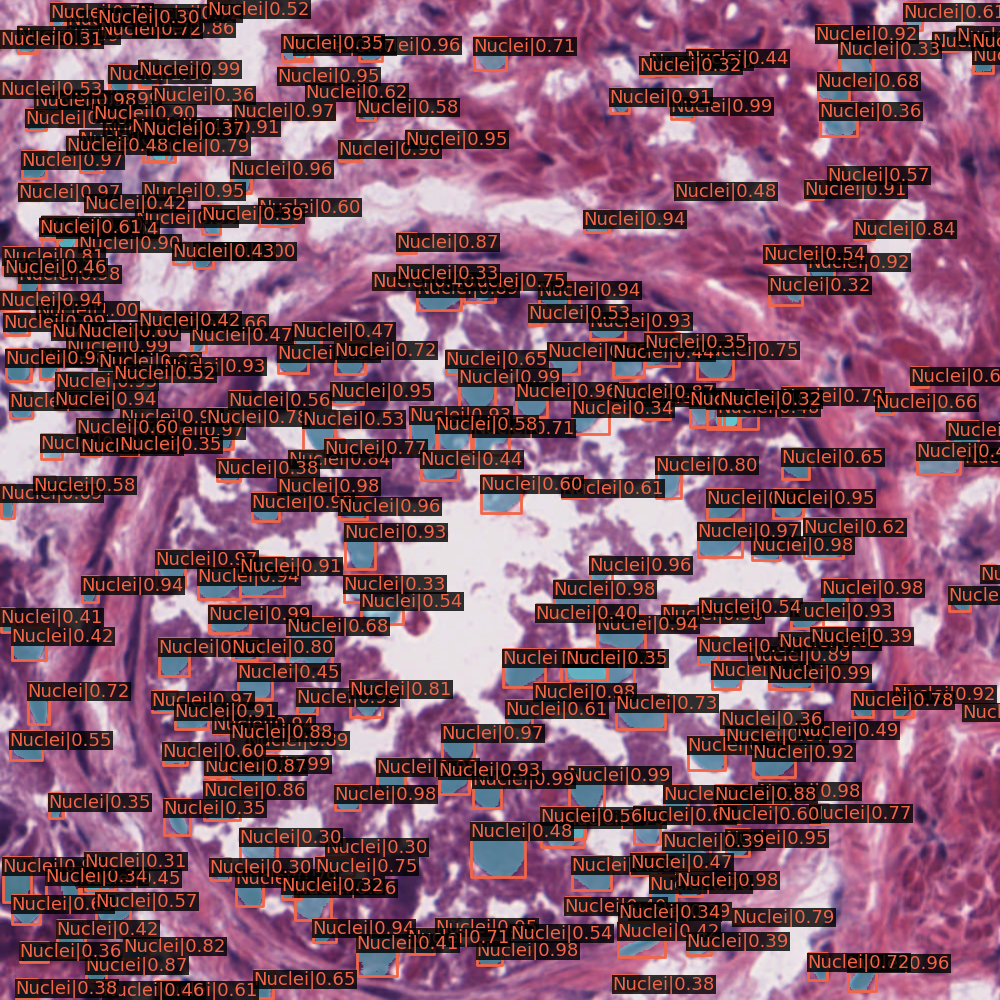

#  SVHN Object Detection

This repository is the implementation of CodaLab competitions [Nuclei segmentation](https://codalab.lisn.upsaclay.fr/competitions/333?secret_key=3b31d945-289d-4da6-939d-39435b506ee5#learn_the_details). 

Inference Result



## Fork from mmdetection

https://github.com/open-mmlab/mmdetection

## Requirements

To install requirements:

```setup
pip install -r requirements.txt
```

## Training

To train the model(s), run this command:

```train
python3 tools/train.py <config_path> --work-dir <output_dir> --gpu-ids <gpu id>
```

* optimizer  use `SGD`, momentum = 0.9, weight_decay = 1e-3,lr=1e-3
* Data augmentation(ShiftScaleRotate, RandomBrightnessContrast, RGBShift, HueSaturationValue, Blur, RandomFlip, ShiftScaleRotate)

## Reproduceing Submission(Inference)

[model link](https://drive.google.com/file/d/1ogQIq5IpsxPJ94RMBj0IC3HJumWlIAHr/view?usp=sharing)

To Inference my model: [inference.ipynb](https://colab.research.google.com/github/a07458666/digital_object_detection/blob/master/inference.ipynb)

```
python3 tools/test.py ./configs/nuclei_custom_config.py <model_path(.pth)> --format-only --options "jsonfile_prefix=./results
```

>📋 Will output `results.segm.json`, `results.bbox.json`

## Pre-trained Models

You can download pretrained models here:


|    Backbone     |  Style  | Lr schd | Mem (GB) | Inf time (fps) | box AP | mask AP | Config | Download |
| :-------------: | :-----: | :-----: | :------: | :------------: | :----: | :-----: | :------: | :--------: |
|    [X-101-32x8d-FPN](./mask_rcnn_x101_32x8d_fpn_mstrain-poly_3x_coco.py)     |  pytorch  |   3x    | 10.3  |       | 44.3 | 39.5 |         [config](https://github.com/open-mmlab/mmdetection/tree/master/configs/mask_rcnn/mask_rcnn_x101_32x8d_fpn_mstrain-poly_3x_coco.py)   |   [model](https://download.openmmlab.com/mmdetection/v2.0/mask_rcnn/mask_rcnn_x101_32x8d_fpn_mstrain-poly_3x_coco/mask_rcnn_x101_32x8d_fpn_mstrain-poly_3x_coco_20210607_161042-8bd2c639.pth) &#124; [log](https://download.openmmlab.com/mmdetection/v2.0/mask_rcnn/mask_rcnn_x101_32x8d_fpn_mstrain-poly_3x_coco/mask_rcnn_x101_32x8d_fpn_mstrain-poly_3x_coco_20210607_161042.log.json)
|    [X-101-64x4d-FPN](./mask_rcnn_x101_64x4d_fpn_mstrain-poly_3x_coco.py)     |  pytorch  |   3x    | 10.4  |       | 44.5 | 39.7 |         [config](https://github.com/open-mmlab/mmdetection/tree/master/configs/mask_rcnn/mask_rcnn_x101_64x4d_fpn_mstrain-poly_3x_coco.py)   |   [model](https://download.openmmlab.com/mmdetection/v2.0/mask_rcnn/mask_rcnn_x101_64x4d_fpn_mstrain-poly_3x_coco/mask_rcnn_x101_64x4d_fpn_mstrain-poly_3x_coco_20210526_120447-c376f129.pth) &#124; [log](https://download.openmmlab.com/mmdetection/v2.0/mask_rcnn/mask_rcnn_x101_64x4d_fpn_mstrain-poly_3x_coco/mask_rcnn_x101_64x4d_fpn_mstrain-poly_3x_coco_20210526_120447.log.json)

## Results

My model achieves the following performance on :

###  Inference segmentation

| Model name         |       mAP       |
| ------------------ |---------------- |
| My best model      |     0.24252     |


## Resources:

- [mmdetection](https://github.com/open-mmlab/mmdetection)
- [convert_annotations](https://github.com/Eruvae/openimages2coco/blob/master/convert_annotations.py)
- [convert mask binary image to polygon format](https://github.com/cocodataset/cocoapi/issues/131)
